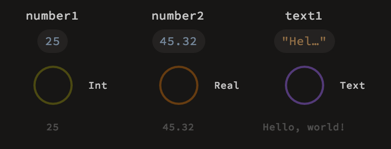
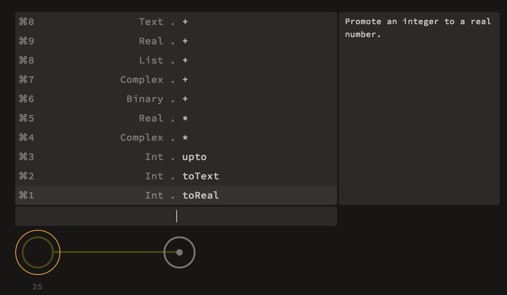

# Basic datatypes

In this section will go through the basic data types available in Luna. You'll encounter some of these in every Luna program.

## Literal values

Luna supports three kinds of literals – expressions of special form, denoting primitive types of data. Those types are `Text`, `Real` and `Int`. Creating literal nodes is as simple as opening the Explorer and typing in the desired value. `Int`s are just numbers without a decimal point, `Real`s are those numbers that do contain a decimal point. `Text`s are arbitrary series of characters, delimited by quotes.



Remember that you can always press <kbd>tab</kbd> with a node of a specific type selected, to bring up the explorer and get a list of all operations supported by the type, together with their documentation.



## Numeric types

The basic numeric types in Luna are `Int`, representing integers of arbitrary size and `Real`, for floating point numbers.

> **[info] Changes ahead!**
>
> Currently, the type of a numeric literal is decided based on the presence of decimal point. This means, that `1` has the type `Int`, while `1.0` has the type `Real`. In the future releases of Luna, the numeric literals will be polymorphic, allowing to write expressions like `1.7 + 2`.

They support basic arithmetic operators and mathematical functions.

## Text

The basic type for text processing in Luna is, unsurprisingly, `Text`. Luna supports two kinds of text literals: interpreted and uninterpreted. The interpreted texts are wrapped in single quotes. They provide the capabilities to insert escaped character sequences such as `\n` etc. The uninterpreted strings are wrapped in double quotes and do not provide any such facilities. The only character that can be escaped in an uninterpreted text is `\"` itself. It is usually sufficient and more handy to use single–quoted (interpreted) texts by default, unless you need to type in a text containing many special characters.

> **[info] Changes ahead!**
>
> In the future releases of Luna the interpreted texts will also allow to insert arbitrary expressions, results of which will be then inserted into the resulting text. For example ``'Adding 2 and 2 gives `2 + 2` in result'`` will be evaluated to `'Adding 2 and 2 gives 4 in result'`.


## Booleans

Logical values are represented using the `Bool` class. It has two constructors: `True` and `False`. They support basic logical combinators such as `&&`, `||` or `not`.

 The most common function used for conditional branching in Luna is `if_then_else`. It can be used in this form (i.e. `if_then_else condition valueWhenTrue valueWhenFalse`) or, more elegantly, in its _mixfix_ form:

```ruby
if condition then valueWhenTrue else valueWhenFalse
```

There is nothing special about this function, all the arguments are standard values and it returns a value just like any other function would:

```ruby
def reportRelationshipToSeven x:
    relation = if x > 7 then "greater than" else "less than or equal to"
    print (x.toText + " is " + relation + " seven")
```


## Lists & Tuples

The most basic container types in Luna are tuples and lists.

Lists are arbitrary–length containers for same-type values. Some examples are `[3, 4, 5]` of type `List Int` or `['first', 'second', 'third']` of type ``List Text``. There are also some interesting functions and methods in the standard library, that return lists of desired shape – make sure to go through the available methods using the Explorer. Some examples are:

```ruby
1.upto 5                       # => [1, 2, 3, 4, 5]
3.times "hello"                # => ["hello", "hello", "hello"]
[True, False] . cycle . take 5 # => [True, False, True, False, True]
```

Tuples are like lists, but they can store elements of different types and they have statically defined lengths. Some examples are:

```ruby
(1, "hello", False) :: (Int, Text, Bool)
("hi", 3.0)         :: (Text, Real)
```

> **[info] Changes ahead!**
>
> In the future versions of Luna, lists and tuples will be merged into one type – a list which fully understands its structure and allows to encode information about its length and different element types on type level. Thus you may expect code like ``["Hello", 32, False]`` to be valid Luna soon.


## Maybe

Luna, much like other functional languages, does not have a `null` value. That means, if you have a value of type `Int`, there will always be a number, there is no way to have an "invalid" number. If there is a possibility of a value not being there, it needs to be encoded in a type-safe manner. This is where `Maybe` enters the stage. A value of class `Maybe` can either be `Just value` or `None`. You can check which of the possibilities happened using pattern matching. Suppose you have a value `myNumber` of type `Maybe Int`. You can use it like so:

```
reportedValue = case myNumber of
    Just v -> 'Got a number ' + v.toText + '.'
    Nothing -> 'Did not get a number.'
print reportedValue
```
There is also a bunch of useful methods like `getWithDefault`, which are handy to replace the pattern match in most cases. Consult Explorer for more details.
