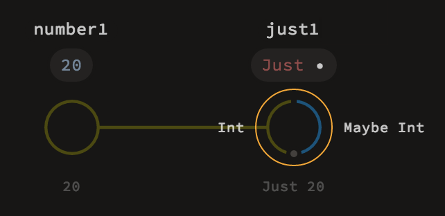
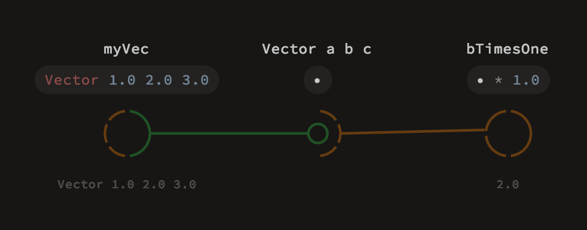

# Constructors and Pattern Matching

Constructors associated with classes have two important roles. First, they provide a way to create objects of a given class. Second, they are used as patterns, allowing to discover what constructor was used to create a given object and to access its fields.

## Object construction

Constructors can be used as ordinary functions. They take as their arguments values for the fields (in order of declaration) and return an object of the given class. For example, the definition for `Maybe` class:

```
class Maybe a:
    Just a
    Nothing
```

gives rise to two such values:

```
Just :: a -> Maybe a
Nothing :: Maybe a
```




Note that since the `Nothing` constructor has no fields, it is not a function, it's a constant, that can assume the type `Maybe a` for any choice of `a`.

## Pattern matching

The other use of constructors is for pattern matching. This allows to unpack an object into it's constituent fields, assuming the constructor used in pattern match is the same as the one assigned to the object. First of all, you may use patterns on the left-hand-side of assignment operator. This assigns the values of fields to the variables mentioned in the pattern. Let's see how this can be used with the `Vector` class defined like so:

```
class Vector:
    x y z :: Real
```

```
myVec = Vector 1.0 2.0 3.0
Vector a b c = myVec
bTimesOne = b * 1.0
```


You need to be careful with this construction though! It assumes that you have picked the right constructor and a mismatch will result in a runtime error. As a rule of thumb, you should use this form of pattern matching only on classes that have one constructor (thus making sure there is no possibility for an error).

## Case expression

The case expression is the most general way to handle pattern matching. It is also generally the safest and when in doubt you should always resort to this form of pattern matching.
It's a mechanism allowing to discover which particular constructor was used to create a given object and to provide a different value for each of the possibilities.

Let's get back to the `Shape` example once again. Suppose we have facilities for rendering circles and rectangles and we need to render general `Shape`s. This can be accomplished with a simple case expression:

```
def render shape:
    case shape of
        Circle c r: drawCircle c r
        Rectangle tl br: drawRectangle tl br
```

The structure is pretty straightforward: first, between the `case ... of` we need to provide the object which identity we need to discover and then we provide a series of clauses, each providing a return value to use in the case of the particular constructor.